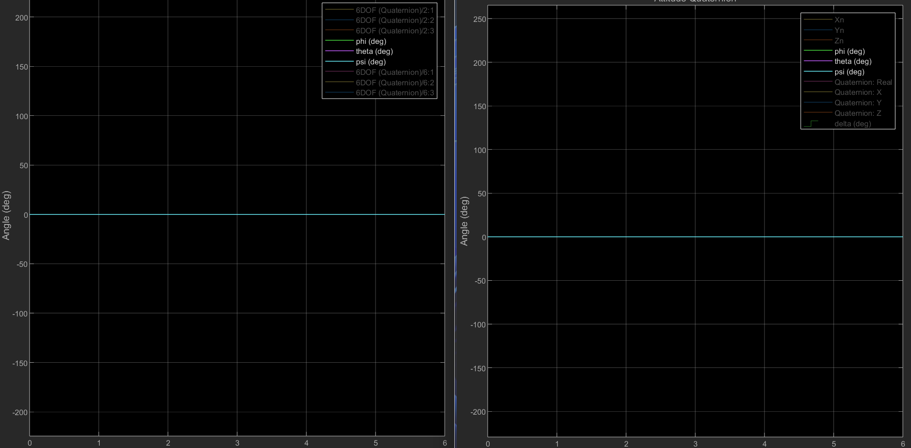
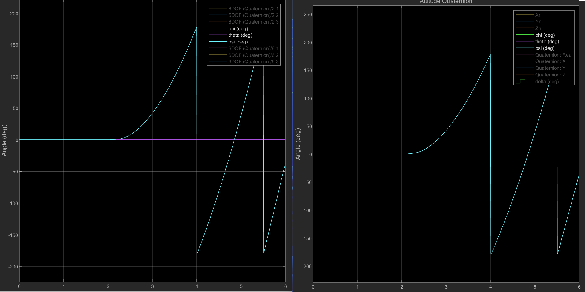
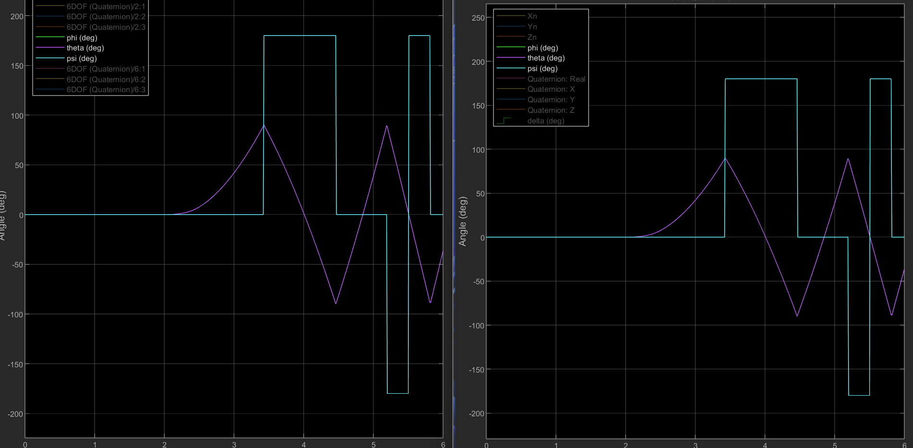
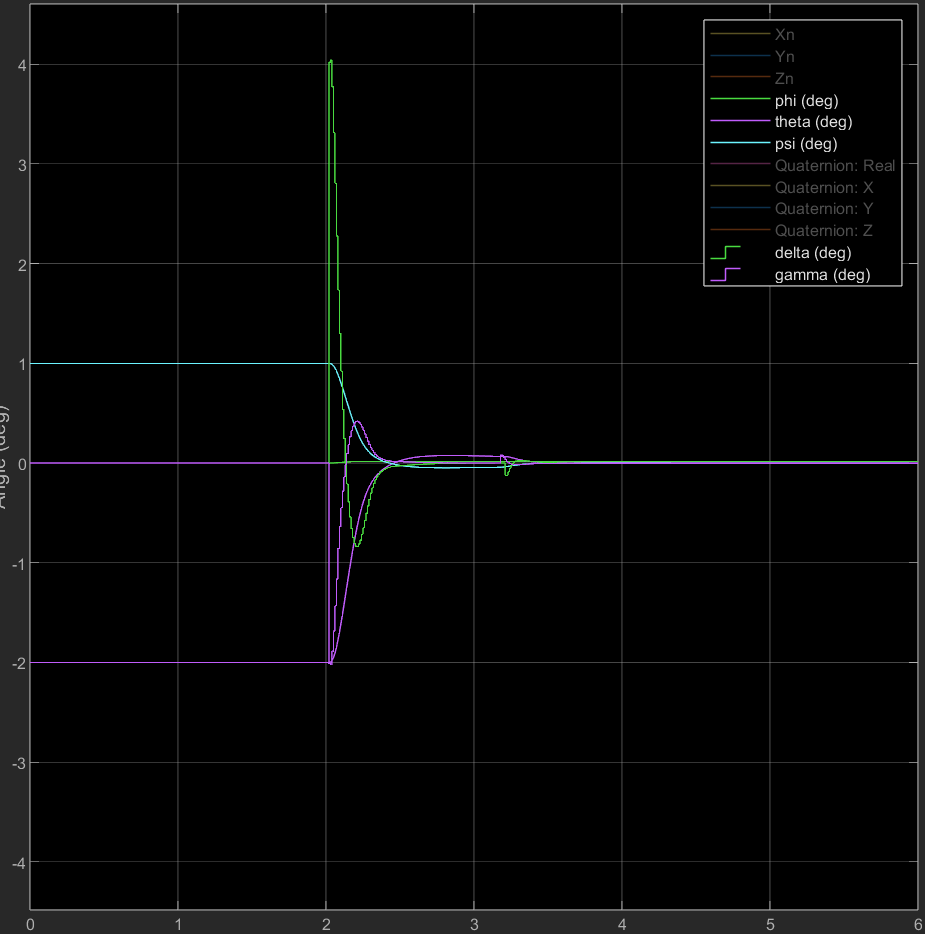
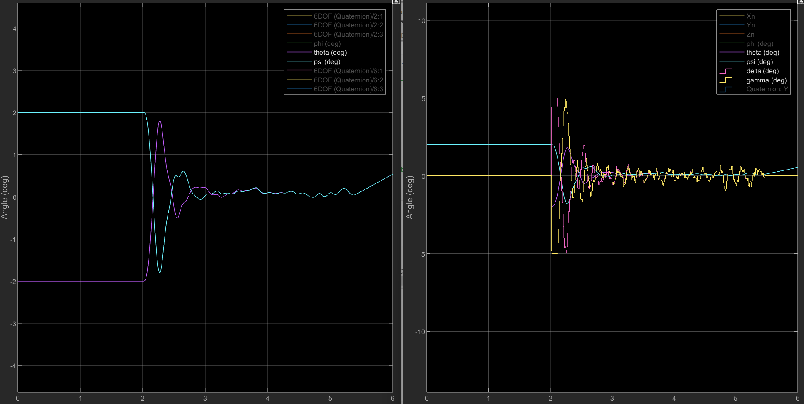

# Day 10 Deliverable: 6DoF Plant and Controller Model

- Student created 6DoF plant model was compared to native Simulink 6DoF block. See *6DoF Derivation.pdf* for equations of motion.
  
  - Key simplifying assumptions: Rocket modeled as a particle ($I_{xx} = I_{yy} = I_{zz}$), constant mass, absence of any torques about the x-axis.

- Plant models compute in quaternion, which is converted to euler angles ($\theta$ and $\psi$ following a 321 passive rotation order).

- Each euler angle is fed into a seperate, decoupled PID controller, governing a thrust gimbal angle, $\delta$ and $\gamma$ respectively.
  
  - Controller is run at a frequency of $100 \space Hz$, translating to a sample time $T_s = 0.01 \space s$.
  
  - Controller targets are $\theta = \gamma = 0 \degree$; this means some lateral drift in y and z will not be corrected by the controller if the target attitude is met.

## Initial Plant Verification

By comparing the student created 6DoF plant model with the native 6DoF block, its accuracy can be easily tested. In these tests, the model has no initial offsets or disturbances and $\delta$ and $\gamma$ are set manually, with the controller disabled.

#### Case 1: $\delta = \gamma = 0 \degree$

- All euler angles remain constant in both models, as expected in this trivial case.

#### Case 2: $\delta = 0 \degree; \space \gamma = 1 \degree$

- Both models show $\psi$ gradually accelerating into a sawtooth wave pattern, as expected.

#### Case 3: $\delta = 1 \degree; \space \gamma = 0 \degree$

- Following similar input profile as case 3, drasticallly different looking output, rotating seemingly on 2 axes instead of 1.
  
  - What's really happening: effects of gimbal lock/singularity inherent in converting quaternions to euler angles for output; this sort of behavior affecting the pitch axis is inherent in 321 rotation orders.
  
  - This output ultimately shows the same 1-axis rotation as case 2, just in the pitch direction.
  
  - Euler angles will not be satisfactory to run a controller if the plant turning more than $90 \degree$ in the pitch or $180 \degree$ in the yaw direction is anticipated.

- Of note is both plots are exactly the same, further confirming the student created plant model's accuracy.

## Controller Tests

2 seperate PID controllers with common gains were used, one governing $\theta$ via $\delta$ and the other $\psi$ via $\gamma$.

#### Case 1:

Gains: $K_p = 2$, $K_i = 0.01$, $K_d = 0.3$.

Environmental Condtions: $\theta_i = -2 \degree$, $\psi_i = 1 \degree$; launch at $t=2\space s$ no sensor bias or noise modeled.

- Controller quickly and efficiently corrects attitude, with slight blip at $t \approx3.3 \space s$
  
  - Blip was discovered to be a result of a programming error in controller's windup clampdown algorithm; once fixed $K_i$ dramatically increased, as will be show below.

- Stability is reached in both $\theta$ and $\psi$ from 2 opposite deflections of different magnitude.

#### Case 2

Gains: $K_p = 2$, $K_i = 0.3$, $K_d = 0.3$.

Environmental Condtions: $\theta_i = -2 \degree$, $\psi_i = 1 \degree$; launch at $t=2\space s$; sensor bias and nosie modeled from real data.

Controller modifications from previous case: integral windup fixed; low-pass filter with time-constant $2T_s = 0.02 \space s$ added to derivative term of both controllers.

- $\theta$ and $\psi$, while obviously noisy, quickly approach and stay less than $.2 \degree$ off of target. Also of note is how both angles converge to the same, slightly non-zero values.
  
  - Experimenting with a larger $K_i$ did not remove this steady-state error; its cause is a slight change in $\phi$, as will be shown later.

- $\delta$ and $\gamma$ only briefly saturate at ignition, otherwise staying well within saturation and rate of deflection limits with minimal noise.

#### Case 3

Gains: $K_p = 2$, $K_i = 0.3$, $K_d = 0.4$.

Environmental Condtions: $\theta_i = 5 \degree$, $\psi_i = -3 \degree$; launch at $t=2\space s$; sensor bias and nosie modeled from real data.

Controller modifications from previous case: None.

- Overall stability is still shown at higher offset angles
  
  - Worth noting initial extreme oscillations, especially in $\theta$; hence the increase of $K_d$ from $0.3$ to $0.4$.

- Non-zero roll angle ($\phi$)
  
  - This is due to the inherent coupling between the euler angle equations of motion that are reintroduced when we convert our quaternion attitude to euler angles. This means that any time the model both pitches and yaws, a roll deflection will occur even in the absence of $\omega_x$. This roll angle also affects the target pitch and yaw angle; making them have a steady-state error uncorrectable by the controller I term.
  
  - This is an inherent flaw in our controller setup: by having 2 independent PIDs unable to control roll, it cannot adjust for any roll that does occur, whether minute effects in simulation above or major disturbances in a real launch.

## Conclusion

The 6DoF plant and controller are constrained by mutually contradictory assumptions that keep them from working in perfect harmony with each other. While they may still be adequate for our current use case (short TVC ascent followed by parachute descent), it is still marginal at best and will be wholly inadequate for any more complicated maneuvers.

