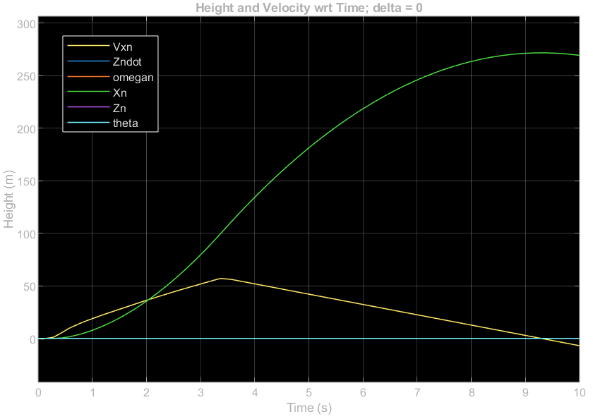

# Day 5 Deliverable: 3DoF EoM Simulink Model

See *MATLAB and Simulink FIles/Open_Loop_3DOF_Plant.slx*.

#### Thrust Curve for Estes F-15 Motor

\Documents\Classes\Summer%2026\Astro%20499\Derek-Weissinger-GNC-Methods-2026\Deliverables\Day%205%203DOF%20EOM\F15%20Thrust%20Curve.png)

- For the engine, $J_t = 49.5 \space Ns$.

- For the entire system, $m =0.543 \space kg$.

- Mass is modeled as constant.

#### Verification 1: Straight Vertical Flight; $\delta = 0$

- $X_n$ shows parabolic behavior after thrust cutoff at $t \approx 3.5$.

- $\theta$ and $\omega_n$ remain constant 0, showing no torque was applied.

- Using the above numbers for total impulse and mass.

#### Verification 2:  $\delta = 2\degree$

\Documents\Classes\Summer%2026\Astro%20499\Derek-Weissinger-GNC-Methods-2026\Deliverables\Day%205%203DOF%20EOM\3DOGTest2.png)

- Angular Velocity $\omega_n$ increases, consistent with positive gimbal angle therefore positive torque

- Angular Velocity remains constant after thrust cutoff at $t \approx 3.5$.

Based on the above verification tests, I am confident I have a working continuous 3 degree of freedom model.

Documentation: No help was used, outside of my notes for the derivation of the EoM and Lt Col Harris explaining how to turn a system of 3 second-order ODEs into a system of 6 first-order
