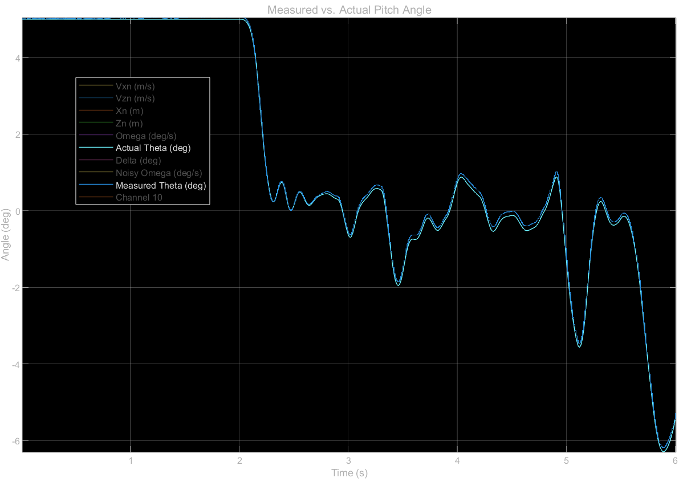
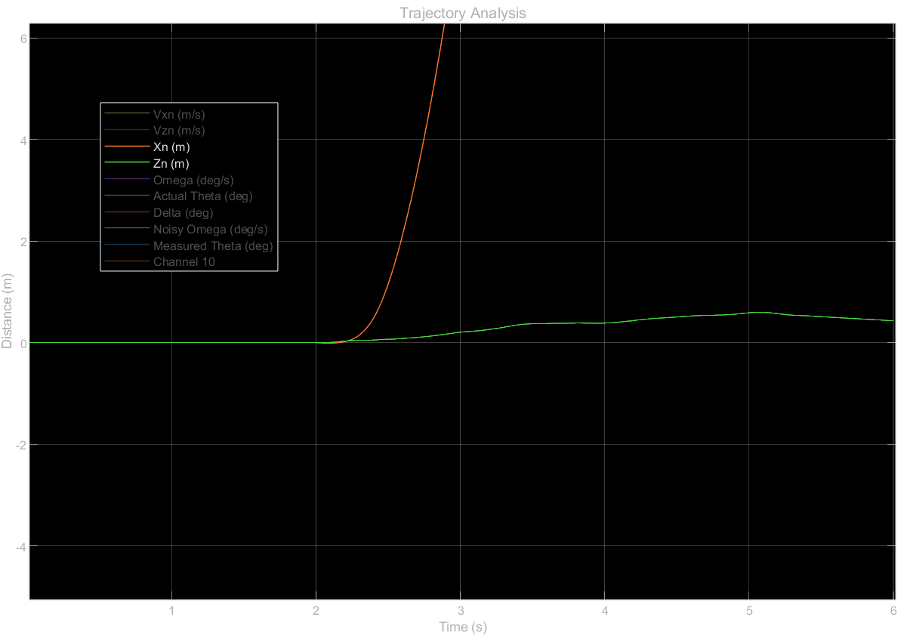
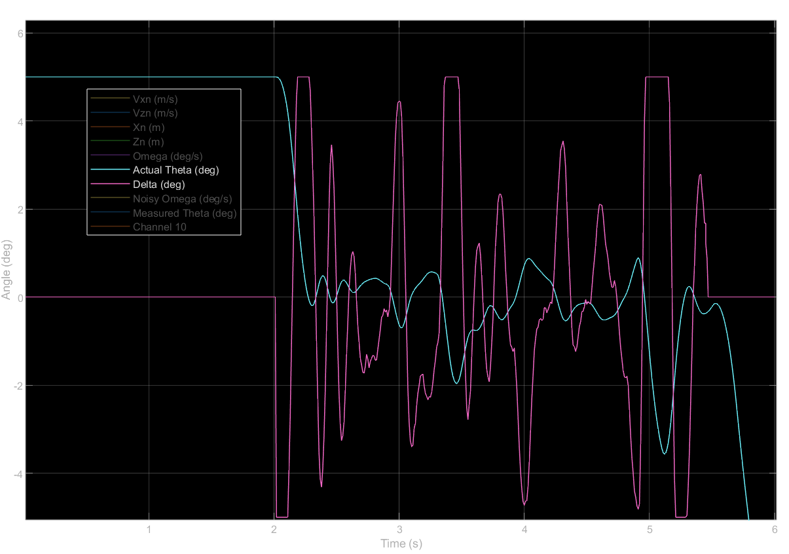

# Day 9 3DoF Discrete Controller

Starting Controller Parameters: $T_s = 0.01;$ LPF Time Constant: $2T_s$;

Starting Gains: $K_p = 2; \space K_I = 0.01; \space K_d = .3$

Noise and initial conditions:

- Noise and bias is added to the simulated gyro based on laboratory measurements taken from the Adafruit BNO085 IMU board. 

- Unless otherwise noted, an initial offset ($\theta_i$) of $5 \degree$ is used and a random torque is applied every .1 seconds, having a mean of $0$ and a variance of $\pm 0.02 \space Nm$.

- The engine is modeled to start at $t = 2.00$ seconds and cut-off at $t = 5.45$ seconds.

See *Model_3DoF_Complete.slx*, ensure *Estes_F15.csv* and *vehicle_params.m* are in the same directory. Use Scope block in Flight Software Subsystem for complete data plots.

#### Quaternion Integrator Demonstration

- Integration is shown to be highly accurate, only slightly drifting in the presence of sensor noise and bias
  
  - Sensor bias is accounted for in integration algorithim, noise is not.

#### Trajectory Analysis

- Model is shown to drift $0.8 \space m$ away from straight vertical flight; overall good result

#### Actuator & Controller Analysis

- $\theta$ remains $\pm 2 \degree$ of vertical for most of powered flight; absolute stability impossible due to disturbance torques
  
  - Trajectory analysis shows overall stability

- $\delta$ is subject to extreme oscillations throughout its entire range of motion with smaller oscillations occuring as well
  
  - Smaller oscillations are due to sensor noise, and dampened with a Low-Pass Filter on the $K_d$ term
  
  - Extreme Oscillations almost exceed actuator's maximum rate of turn; in addition, the many quick reversals will result in the actuator not completing its commanded range of motion, resulting in further instability which is not modeled here.

- Worth investigating if my model of random disturbance torques is realistic, or even necessary.

- **Overall Verdict: Good stability, but $\delta$ oscillations operating marginally close to instability. Proceed to 6DoF, investigate if random torques are necessary/realistic.**

